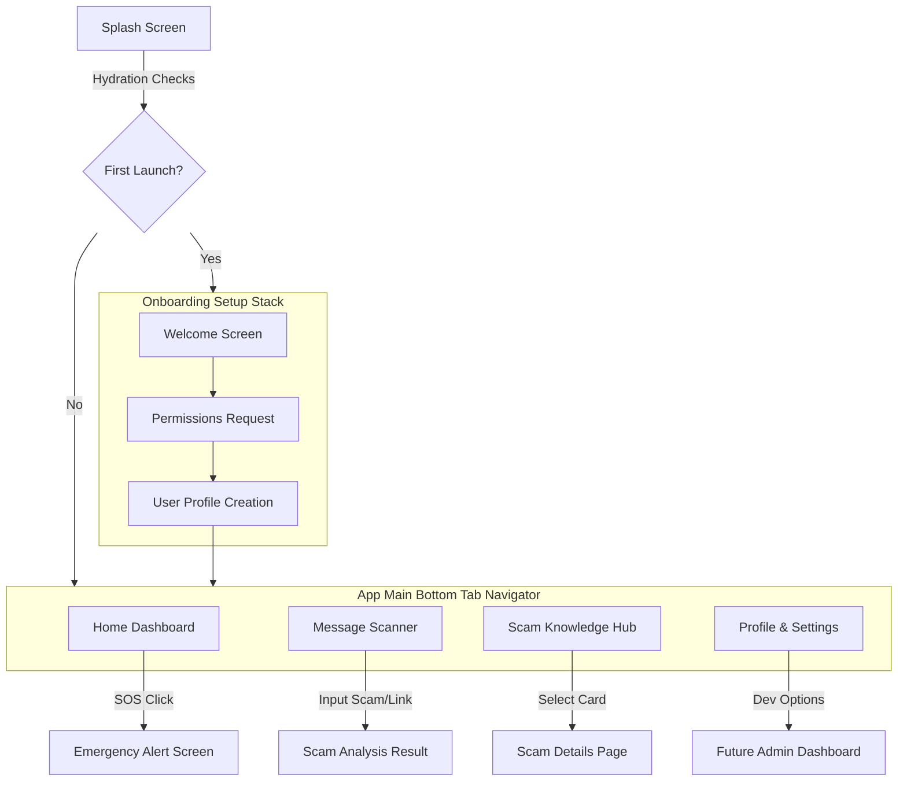

# Rakshak AI - Frontend Architecture Blueprint
**Intelligent Guardian Against Digital Fraud**

This document serves as the master engineering blueprint and technical architecture guide for **Rakshak AI**, a privacy-first Android application designed to protect users from modern digital scams, OTP frauds, digital arrest scams, phishing, and social engineering attacks.

---

## 1. Project Vision & Branding Guidelines

### Project Metadata
* **Project Name**: Rakshak AI (meaning "Protector" or "Guardian")
* **Tagline**: *Your Intelligent Guardian Against Digital Fraud*
* **Target OS Platform**: Android (Minimum SDK: 24, Target SDK: 34 via Expo SDK 51)
* **Architecture Style**: Feature-Oriented Clean Architecture (Screaming Architecture)

### Brand Values
The user interface and user experience (UI/UX) must reflect these core principles:
1. **Trust**: Professional visual elements, secure-looking cues, and zero intrusive ads.
2. **Protection**: Strong, reassuring status indicators, active alert cues.
3. **Privacy**: Clear declarations of on-device computations, local processing notifications.
4. **Simplicity**: Tailored layouts specifically for vulnerable groups (e.g., senior citizens), utilizing large typography and high-contrast, easily tappable buttons.
5. **Reliability**: Instant, deterministic responses, highly visible emergency status widgets.

---

## 2. Scalable Folder Structure

Rakshak AI implements a feature-modular structure. The project is organized to separate branding files, documentation, codebase configuration, and screen-specific UI assets.

Below is the directory tree created by the bootstrap process:

```text
rakshak-ai/
│
├── .editorconfig          # Editor settings consistency across IDEs
├── .env.example           # Example local environment variable template
├── .eslintrc.js           # Linting rules matching enterprise code styles
├── .gitignore             # Standard node/android/expo ignore rules
├── .prettierrc            # Automatic formatting configurations
├── ARCHITECTURE.md        # This master architecture document
├── package.json           # Project manifest and core dependencies
├── tsconfig.json          # TypeScript configurations and module path mapping
│
├── design/                # Brand identity & design resources
│   ├── wireframes/        # Low-fidelity UX wireframes and flow plans
│   ├── mockups/           # High-fidelity screen designs (Figma exports)
│   ├── assets/            # Direct UI visual exports (illustrations, logos)
│   └── branding/          # Typography assets, style guides, and brand color swatches
│
├── docs/                  # Project & academic documentation (SIP specific)
│   ├── architecture/      # Diagram files (Mermaid, DB, System topology)
│   ├── api/               # API endpoint definitions and response payloads
│   ├── screens/           # UX copy scripts, screen flows, and interactive maps
│   ├── sprints/           # Sprint logs, project tracking checklists
│   └── research/          # Cybersecurity case studies, scam database logs
│
└── src/                   # React Native application source code
    ├── assets/            # Embedded app fonts & static image resources
    │   ├── fonts/         # Custom fonts (e.g., Outfit, Inter)
    │   └── images/        # Embedded system-level icons, default illustrations
    │
    ├── components/        # Reusable UI component modules
    │   ├── common/        # General atoms & molecules (Buttons, Inputs, Spacers)
    │   ├── dashboard/     # Custom widgets specifically for the home dashboard
    │   ├── scanner/       # Message scanning, analysis visualization items
    │   └── education/     # Knowledge cards, article previews, quiz items
    │
    ├── screens/           # Main screen view containers (Layout wrappers)
    │   ├── splash/        # Boot animation, initial hydration & token verification
    │   ├── onboarding/    # Setup guides, initial user profile creation, permissions opt-in
    │   ├── dashboard/     # Core dashboard view, scam activity status
    │   ├── scanner/       # Text copy-paste box, file upload scanner UI
    │   ├── analysis/      # AI detection visual reports, threat score speedometer
    │   ├── education/     # Scam prevention categories, tips index
    │   ├── emergency/     # Direct SOS actions, immediate call-to-action guidelines
    │   ├── profile/       # User profile details, theme switcher, permissions status
    │   └── admin/         # Future simulation settings, local threat feeds override
    │
    ├── navigation/        # Screen routing configs, Stack & Tab definitions
    ├── store/             # Global stores managed via Zustand
    ├── services/          # Future API, AI Clients, and Native Event Listener layers
    ├── hooks/             # Custom custom hooks (e.g., usePermissions, useScamScanner)
    ├── theme/             # Design token constants (Colors, Typography, Spacing, Themes)
    ├── utils/             # Reusable helper algorithms (String formatting, risk level calculations)
    ├── types/             # Common TypeScript declarations, routes, custom models
    └── constants/         # Static configuration settings (App flags, API endpoints)
```

---

## 3. Dependency Blueprint

Dependencies are selected to guarantee scalability, type safety, fluid performance, and an easy transition to production.

### Core & Framework Packages
* **`expo`** (~51.0.17): Modern React Native workflow engine, facilitating secure native modular updates without immediate native compilation issues.
* **`expo-status-bar`** (~1.12.1): Fluid control of status bar appearance across dark/light screen modes.
* **`react`** (18.2.0) & **`react-native`** (0.74.5): Underlying core framework versions.
* **`expo-secure-store`** (~13.0.2): Standard device keychain encryption library, essential for securely saving future local API keys (Gemini / OpenAI), user settings, and private keys.
* **`expo-file-system`** (~17.0.1): Full disk access library, utilized for local image cache management, offline TF-Lite model storage, and scanning logs.

### Navigation Architecture
* **`@react-navigation/native`** (^6.1.17): Standard declarative React Native routing engine.
* **`@react-navigation/stack`** (^6.3.29): Native stack handling for screen transits (e.g., transitioning to *Scam Analysis Result*).
* **`@react-navigation/bottom-tabs`** (^6.5.20): Main layout container with fluid bottom-navigation icons.
* **`react-native-safe-area-context`** (4.10.5): Prevents interactive items from clipping behind notch, status bars, and camera holes.
* **`react-native-screens`** (3.31.1): Optimizes OS-level memory optimization for background route trees.
* **`react-native-gesture-handler`** (~2.16.1) & **`react-native-reanimated`** (~3.10.1): Fluid native 60fps micro-animations.

### UI & Styling System
* **`react-native-paper`** (^5.12.3): Material Design 3 (MD3) implementation. Essential for responsive inputs, custom modal states, and visual progress meters.
* **`react-native-svg`** (15.2.0): Crisp vector assets (charts, dashboard speedometers, scam icons) which load seamlessly with zero pixelation across different PPI displays.
* **`@expo/vector-icons`** (^14.0.2): Built-in library providing icons (Feather, MaterialIcons, Ionicons) that align with safety/protection themes.

### Utilities & AI Interfacing
* **`axios`** (^1.7.2): Standard client wrapper for HTTP calls, equipped with interceptor pipelines for API auth injects and logging.
* **`zod`** (^3.23.8): Runtime validation tool, protecting UI rendering from crashes caused by unpredictable LLM or scam parser outputs.
* **`zustand`** (^4.5.2): State engine choice. Lightweight, zero boilerplate, compatible with persistent AsyncStorage hooks.
* **`@react-native-async-storage/async-storage`** (1.23.1): Local persistence store, serving as Zustand's local backend for offline configurations.

---

## 4. Installation and Project Setup

Execute the following commands in the project root to install the ecosystem dependencies:

```bash
# 1. Install Expo command line interface globally (if not already installed)
npm install -g expo-cli

# 2. Run clean module install
npm install

# 3. Verify TypeScript structures are recognized
npm run ts:check
```

---

## 5. Navigation Architecture & Flow

### Navigation Paradigm
Rakshak AI implements a structured split-route layout:
* **RootNavigator** (Switch navigator based on initialization states)
  * `Splash`: Initial asset loading and configuration check.
  * `OnboardingStack`: Steps for permission checks (SMS access, contacts check), profiling, and visual introduction cards.
  * `AppNavigator` (Bottom Tab Navigator containing main application modules)
    * `DashboardTab` -> Stack to `EmergencyAlert` and `ScamDetails`
    * `ScannerTab` -> Stack to `ScamAnalysisResult`
    * `EducationTab` -> Stack to `ScamDetails`
    * `ProfileTab` -> Stack to `AdminSettings`

### Navigation Flow Diagram



### TypeScript Navigation Types Blueprint
Create this in `src/navigation/types.ts`:

```typescript
import { NavigatorScreenParams } from '@react-navigation/native';

export type OnboardingStackParamList = {
  Welcome: undefined;
  PermissionsSetup: undefined;
  UserProfileSetup: undefined;
};

export type AppTabParamList = {
  HomeTab: undefined;
  ScannerTab: undefined;
  KnowledgeTab: undefined;
  ProfileTab: undefined;
};

export type RootStackParamList = {
  Splash: undefined;
  Onboarding: NavigatorScreenParams<OnboardingStackParamList>;
  App: NavigatorScreenParams<AppTabParamList>;
  ScamAnalysisResult: {
    scamText?: string;
    riskScore: number;
    scamType: string;
    indicators: string[];
    remediationSteps: string[];
  };
  ScamDetails: {
    scamId: string;
    title: string;
    description: string;
    protectionTips: string[];
  };
  EmergencyAlert: {
    scamScenarioType?: string;
  };
  AdminSettings: undefined;
};
```

---

## 6. Reusable Component Strategy

To maintain a consistent styling aesthetic (vibrant dark-modes, clear semantic indicators), components are split into specific folders.

```text
src/components/
├── common/
│   ├── CustomButton.tsx        # Styled action button (Primary, Secondary, Danger states)
│   ├── AlertCard.tsx           # Large card highlighting scam warnings or emergency messages
│   ├── StatusBadge.tsx         # Pill badges representing danger metrics (Safe, Warn, High Risk)
│   └── Header.tsx              # Modular application navigation bar with SOS trigger support
│
├── dashboard/
│   ├── RiskCard.tsx            # Main visual element showing user's current local threat exposure
│   └── ScamCategoryCard.tsx    # Visual tile matching current trending scam structures
│
├── scanner/
│   ├── RiskDial.tsx            # Visual metric dial displaying analysis score (SVG-driven)
│   └── AlertDetailsBox.tsx     # Breakdowns of malicious text patterns found in scanned alerts
│
└── education/
    ├── ArticleCard.tsx         # Image-rich grid components for hub details
    └── QuickQuizCard.tsx       # Dynamic card used to test users' scam knowledge
```

---

## 7. Design System Architecture

To ensure a premium look and feel, Rakshak AI avoids inline styling and generic colors. It uses a consistent, centralized theme.

### Folder Layout
* `src/theme/colors.ts`: Semantic colors matching safety status states.
* `src/theme/typography.ts`: Uniform font styles, weights, and scaling configurations.
* `src/theme/spacing.ts`: Structured margins, padding values, and border radii.
* `src/theme/index.ts`: Standard theme wrappers supporting dark mode.

### Theme Tokens Configuration Example (`src/theme/colors.ts`)
```typescript
export const colors = {
  dark: {
    background: '#0B0F19', // Premium deep night blue
    surface: '#151D30',    // Muted dark panel background
    surfaceContainer: '#1E2942', // Inner elevated surface
    
    // Brand Accents
    primary: '#3F8CFF',    // Electric Shield Blue
    secondary: '#8884FF',  // Muted Purple Protection Accents
    
    // Semantic risk indicators
    safe: '#10B981',       // High trust emerald green
    warning: '#F59E0B',    // Medium risk amber yellow
    danger: '#EF4444',     // Critical hazard soft red
    
    // Typography colors
    textPrimary: '#FFFFFF',
    textSecondary: '#94A3B8', // High legibility slate text
    textMuted: '#64748B',
    
    border: '#2A3654'
  }
};
```

---

## 8. State Management Strategy

### Zustand: The Optimal State Engine
We recommend **Zustand** over Redux Toolkit or Context API for the following reasons:
1. **Zero Boilerplate**: Avoids verbose reducers, action creators, and context providers, which speeds up development.
2. **Optimal Re-renders**: Components subscribe to specific properties of the store, preventing unnecessary UI renders.
3. **Persist Middleware**: Includes native support to automatically save state to `AsyncStorage` with minimal configuration.

### Store Architecture: Config State (`src/store/useConfigStore.ts`)
```typescript
import { create } from 'zustand';
import { persist, createJSONStorage } from 'zustand/middleware';
import AsyncStorage from '@react-native-async-storage/async-storage';

interface UserProfile {
  name: string;
  isRegistered: boolean;
  onboardingCompleted: boolean;
  smsTrackingAllowed: boolean;
}

interface ConfigState {
  profile: UserProfile;
  appVersion: string;
  isDarkMode: boolean;
  updateProfile: (profile: Partial<UserProfile>) => void;
  toggleTheme: () => void;
}

export const useConfigStore = create<ConfigState>()(
  persist(
    (set) => ({
      profile: {
        name: '',
        isRegistered: false,
        onboardingCompleted: false,
        smsTrackingAllowed: false,
      },
      appVersion: '1.0.0',
      isDarkMode: true,
      updateProfile: (profileUpdates) =>
        set((state) => ({
          profile: { ...state.profile, ...profileUpdates },
        })),
      toggleTheme: () => set((state) => ({ isDarkMode: !state.isDarkMode })),
    }),
    {
      name: 'rakshak-config',
      storage: createJSONStorage(() => AsyncStorage),
    }
  )
);
```

---

## 9. API & Future Network Architecture

To support future AI and backend functionality, we establish a scalable layer for network requests.

```text
src/services/
├── api/
│   ├── apiClient.ts          # Central Axios configuration and middleware interceptors
│   ├── scamService.ts        # Endpoint interfaces for threat feeds and scan uploads
│   └── userService.ts        # Handlers for secure device registration
├── native/
│   ├── smsListener.ts        # Scaffolds for native Android SMS broadcast receivers
│   └── notificationHub.ts    # Hooks targeting Android accessibility events
└── ai/
    ├── geminiClient.ts       # Service mapping to Google Gemini API
    └── tfLiteHelper.ts       # Orchestrator load files targeting mobile offline models
```

### Type-Safe API Client Blueprint (`src/services/api/apiClient.ts`)
```typescript
import axios from 'axios';
import * as SecureStore from 'expo-secure-store';

const API_TIMEOUT = 10000; // 10 seconds timeout

export const apiClient = axios.create({
  baseURL: process.env.EXPO_PUBLIC_API_URL || 'https://api.rakshakai.org/v1',
  timeout: API_TIMEOUT,
  headers: {
    'Content-Type': 'application/json',
    Accept: 'application/json',
  },
});

// Request Interceptor: Automatically inject API key / User token
apiClient.interceptors.request.use(
  async (config) => {
    const token = await SecureStore.getItemAsync('user_session_token');
    if (token && config.headers) {
      config.headers.Authorization = `Bearer ${token}`;
    }
    return config;
  },
  (error) => {
    return Promise.reject(error);
  }
);

// Response Interceptor: Global Error Interception & Recovery
apiClient.interceptors.response.use(
  (response) => response,
  async (error) => {
    const originalRequest = error.config;
    
    if (error.response) {
      const status = error.response.status;
      
      // Handle Unauthorized status
      if (status === 401 && !originalRequest._retry) {
        originalRequest._retry = true;
        // Logic to refresh session tokens using secure store keys goes here
      }
      
      // Standardize system error format
      return Promise.reject({
        code: error.response.data?.code || 'SERVER_ERROR',
        message: error.response.data?.message || 'An unexpected server error occurred',
        status: status,
      });
    }
    
    // Offline / Connectivity errors
    if (error.code === 'ECONNABORTED' || error.message.includes('Network Error')) {
      return Promise.reject({
        code: 'NETWORK_DISCONNECTED',
        message: 'No internet connection detected. Rakshak AI is running in offline protection mode.',
      });
    }
    
    return Promise.reject(error);
  }
);
```

---

## 10. Security & Privacy Architecture

As a cybersecurity product, **Rakshak AI** uses a privacy-first design model to protect user data from external theft.

### 1. Data Privacy Principles
* **Local Processing First**: Message processing, phone number checks, and metadata extraction are performed on-device. SMS text is not stored on a server without explicit user action (such as manually submitting a report).
* **Anonymization**: Data sent to servers for scoring is hashed using SHA-256 to remove personally identifiable information (PII).

### 2. On-Device AI Architecture (Future Vision)
* **Model Inference**: Small, quantized TF-Lite models reside directly in the Android binary. This enables offline scanning of incoming SMS text messages without leaking data to cloud endpoints.
* **Fallback Logic**: Online LLM APIs (Gemini/OpenAI) are only queried with the user's explicit consent for deep analysis of complex phishing attempts.

### 3. Permission Management Strategy
* **Minimum Privilege Access**: The application starts in a sandbox state. It requests optional permissions, such as SMS reading, contacts access, and notification monitoring, only when users trigger related features.
* **Permission Hooks**: Dedicated React hooks query the current permission status and explain why a permission is needed before triggering the native OS prompts.

### 4. Secure Storage Recommendations
* **Sensitive Values**: API keys, user tokens, and salts are stored exclusively in `expo-secure-store`, which uses Android Keystore encryption.
* **Non-Sensitive Configurations**: General layout preferences are stored in standard `AsyncStorage`.

---

## 11. Product Roadmap

The development of Rakshak AI is organized into distinct, incremental phases:

```text
Phase 0: Architecture & Setup (CURRENT)
└── Design system structure, set folder rules, and configure workspace tools

Phase 1: Design System & Branding
└── Define colors, typography, assets, and standard design variables in the codebase

Phase 2: Frontend Prototype
└── Build UI screens, set navigation, mock data flows, and prototype emergency alerts

Phase 3: AI Integration & Key Storage
└── Implement Expo Secure Store, integrate Gemini API, and prototype risk calculation dials

Phase 4: Local SMS Analysis Setup
└── Build native Android SMS receiver mockups, compile TF-Lite files, and support offline analysis

Phase 5: Voice & Call Analysis Mockups
└── Design call analysis layouts and test on-device audio stream inputs

Phase 6: Final Production Release
└── Complete security audits, verify GDPR/DPDP privacy compliance, and publish to Play Store
```

---

## 12. Future Scalability Considerations

To support future enhancements, the architecture is designed to accommodate:

1. **SMS Monitoring**: Custom Android broadcast receivers can hook into standard intent events and send scanned messages straight to Zustand's threat analyzer store.
2. **Notification Scanning**: Android accessibility event hooks can intercept message notifications and process them locally in real time.
3. **Voice Scam Recognition**: Future updates can use the microphone listener to record and analyze audio in real time, scoring conversation risk on-device.
4. **Offline AI Execution**: Place local `.tflite` model files directly inside `src/assets/models` and process them using ONNX or TF-Lite React Native wrappers.
5. **Federated Learning**: Train models locally on user devices and periodically upload weight updates to a central server in a privacy-preserving manner.
6. **Multi-Language Support**: Integrate translation setups (such as standard `i18n`) in the `src/utils` folder to translate the interface into regional languages.

---

## 13. Best Practices & Guidelines

### TypeScript Conventions
* Set `strict: true` in the compilation configuration.
* Avoid using `any`. Instead, use `unknown` if the type of an input is unpredictable (e.g., payloads from public API queries) and validate the data using `zod` schemas.

### Coding Rules
* Define file names using camelCase (e.g., `apiClient.ts`, `useConfigStore.ts`).
* Use PascalCase for screen containers and React UI elements (e.g., `RiskCard.tsx`, `DashboardScreen.tsx`).
* Store visual variables (such as paddings, margins, and borders) inside `src/theme/spacing.ts` instead of using hardcoded styling values.
