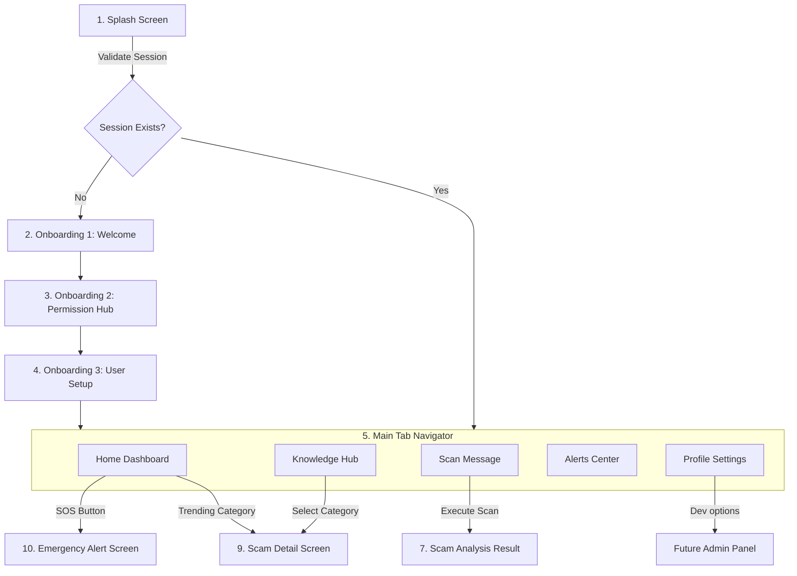

# Rakshak AI - User Experience Architecture Blueprint
**Document Version**: 1.0.0
**Target Platform**: Android (Mobile First)

This document establishes the user experience (UX) architecture for **Rakshak AI**. It defines user journeys, application navigation flows, detailed screen layouts, reusable component inventories, and states to prepare the project for development.

---

## Part 1: Product Journeys

### 1. First-Time User Journey (Onboarding)
* **Entry Point**: Play Store installation -> App launch.
* **User Goal**: Establish protection shield with clear, understandable permissions.
* **Flow**:
  1. *Splash Screen*: Displays brand logo, taglines, and verifies storage.
  2. *Welcome Card (Onboarding 1)*: Explains how the app works and introduces the "Intelligent Sentinel" concept.
  3. *Permission Center (Onboarding 2)*: Explains *why* SMS and notification accesses are requested.
  4. *Profile Creation (Onboarding 3)*: Gathers user's first name, primary language, and registers a secure local session.
* **Decisions**: User opts-in or skips SMS permissions.
* **Success Outcome**: Dashboard initialized with an active security rating and custom greeting.

### 2. Returning User Journey (Routine Monitoring)
* **Entry Point**: App launch / Notification click.
* **User Goal**: Check security status and view recent alerts.
* **Flow**:
  1. *Splash Screen*: Quickly hydrates state from `AsyncStorage` (takes less than 500ms).
  2. *Home Dashboard*: Displays the central **Protection Status dial** ("Safe", "Warning", or "Critical").
  3. *Action*: User views active threats, checks scanned statistics, or navigates to the knowledge base.
* **Success Outcome**: User quickly confirms their device is protected.

### 3. Scam Detection Journey (Active Scanning)
* **Entry Point**: User copies a suspicious text -> Opens app -> Tap "Scan" or clicks on a suspicious SMS alert.
* **User Goal**: Confirm if a message, UPI ID, or link is a scam.
* **Flow**:
  1. *Scan Message Screen*: Paste text box or choose file upload.
  2. *Analysis Loading*: Progress spinner with security scanning tips.
  3. *Scam Analysis Result*: Visual danger speedometer, list of warning signs (PII requests, fear tactics), and actionable advice.
* **Success Outcome**: User avoids a scam attempt and blocks the sender.

### 4. Scam Learning Journey (Prevention)
* **Entry Point**: Home Dashboard -> Tap "Learn" tab -> Scam Knowledge Hub.
* **User Goal**: Learn how to identify modern scams (e.g., Digital Arrest).
* **Flow**:
  1. *Knowledge Hub*: Search bar, categorized lists (Job Scams, OTP Frauds, APK Malware).
  2. *Scam Detail Screen*: Real-world examples, warning signs, and interactive self-tests.
* **Success Outcome**: User gains awareness to protect themselves offline.

### 5. Emergency Scam Alert Journey (Active Crisis Response)
* **Entry Point**: Active notification detection -> App Alert Banner -> Tap "SOS".
* **User Goal**: Take immediate action to stop an ongoing scam (e.g., shared OTP).
* **Flow**:
  1. *Emergency Alert Screen*: High-contrast warning screen.
  2. *Action Guides*: Steps to take immediately (e.g., "Dial 1930", "Block Bank Account").
  3. *Hotlines*: Tap-to-dial buttons for cybersecurity helplines.
* **Success Outcome**: User stops a financial transaction before funds are transferred.

---

## Part 2: Application Navigation Flow



---

## Part 3 & 4: Screen Hierarchy & Detailed Wireframe Architecture

This section details the layout, real estate allocation, component placement, and state behavior for each of the 11 screens.

---

### 1. Splash Screen

* **Purpose**: System initialization, storage hydration, and session validation.
* **Business Goal**: Establish a strong first impression of speed and reliability.
* **User Goal**: Fast load times to access protection dashboard.
* **Success Metric**: System loads within 800ms.
* **Primary Actions**: None (Automated transit).
* **Secondary Actions**: None.
* **Exit Paths**: Redirect to Onboarding (if first run) or Home Dashboard (if returning).
* **Future Scope**: Check for offline AI updates in the background.

#### Layout & Wireframe Allocation
```text
┌────────────────────────────────────────┐
│                                        │
│               [Logo] (20%)             │
│                                        │
│          [Rakshak AI] (10%)            │
│       "Your Intelligent Guardian"      │
│                                        │
│          [Loading Indicator] (10%)     │
│                                        │
│        [On-Device Security Verification]│
│               (Tagline) (50%)          │
│                                        │
└────────────────────────────────────────┘
```
* **Real Estate Allocation**:
  * Brand Logo (Centered Header): `20%`
  * App Name & Tagline: `10%`
  * Activity Loader (Spinner): `10%`
  * Bottom Security Verification Text: `50%` (Reassures users that processing happens on-device).
* **Mobile View Hierarchy**:
  * `SafeAreaView` -> `KeyboardAvoidingView` -> `CenteredView` -> `BrandLogoContainer` -> `BrandText` -> `ActivityIndicator` -> `FootnoteText`.
* **State Behavior**:
  * *Loading State*: Show brand logo and a spinning activity indicator.
  * *Error State*: If state hydration fails, clear storage and redirect to Onboarding.
  * *Offline State*: Works offline. Displays a badge: "Running in local shield mode".

---

### 2. Onboarding Screen 1 (Welcome & Identity)

* **Purpose**: Introduce the app's features to the user.
* **Business Goal**: Build user trust and lower barrier to entry.
* **User Goal**: Understand how the app protects them.
* **Success Metric**: More than 90% of users proceed to the next step.
* **Primary Actions**: Tap "Get Started" button.
* **Secondary Actions**: Tap "Skip Introduction" (redirects to Onboarding 2).
* **Exit Paths**: Navigates to Onboarding 2.

#### Layout & Wireframe Allocation
```text
┌────────────────────────────────────────┐
│ Skip                                   │ -> Navigation link (5%)
│                                        │
│          [Security Illustration]       │ -> Key visual graphic (45%)
│                                        │
│      [Guard Against Digital Scams]     │ -> Heading H1 (15%)
│   Learn how Rakshak AI monitors        │
│   threats on-device.                   │
│                                        │
│          [Progress Dots] (5%)          │
│          [Primary Button] (20%)        │ -> Next step trigger (Height 50px)
│                                        │
└────────────────────────────────────────┘
```
* **Real Estate Allocation**:
  * Top navigation (Skip link): `5%`
  * Graphic area (Security Illustration): `45%`
  * Value Proposition Text (Heading + Description): `25%`
  * Progress Dots: `5%`
  * Primary Button: `20%`
* **Mobile View Hierarchy**:
  * `SafeAreaView` -> `HeaderContainer` -> `BodyScroll` -> `IllustrationWrapper` -> `TextGroup` -> `ProgressDots` -> `ButtonContainer`.
* **Integration Points**:
  * *Backend*: None.
  * *AI*: None.
* **Accessibility**: Large typography (24pt headline), clear visual illustration, and a button touch target of **52px** height.

---

### 3. Onboarding Screen 2 (Permission Center & Why)

* **Purpose**: Request SMS reading and notification monitoring permissions.
* **Business Goal**: Secure permissions to enable core protection features.
* **User Goal**: Understand why these permissions are needed before granting them.
* **Success Metric**: At least 80% of users grant permissions.
* **Primary Actions**: Tap "Enable Protection" button.
* **Secondary Actions**: Tap "Continue without permissions" (opens popup window explaining risk).
* **Exit Paths**: Navigates to Onboarding 3.

#### Layout & Wireframe Allocation
```text
┌────────────────────────────────────────┐
│ Permissions                            │ -> Header H2 (10%)
│                                        │
│      [SMS Access Card] (20%)           │ -> Permission 1 container
│      - Why: To detect scam texts       │
│                                        │
│      [Notification Card] (20%)         │ -> Permission 2 container
│      - Why: To alert you to threats    │
│                                        │
│      [Privacy Assurance Box] (20%)     │ -> High legibility note
│      "Your messages never leave        │
│       your device."                    │
│                                        │
│      [Grant Permissions Button] (15%)  │ -> Main CTA
│      [Maybe Later Link] (15%)          │ -> Bypass option
└────────────────────────────────────────┘
```
* **Real Estate Allocation**:
  * Title Header: `10%`
  * Permission Option Cards: `40%`
  * Privacy Assurance Box: `20%`
  * Main CTA Buttons: `30%`
* **Mobile View Hierarchy**:
  * `SafeAreaView` -> `TitleText` -> `PermissionCardsContainer` -> `PrivacyShieldCard` -> `ButtonContainer`.
* **State Behavior**:
  * *Success State*: Shows green checkmarks next to granted permissions.
  * *Error State*: Displays red caution badge if permission is denied, with a link to "Enable in settings".

---

### 4. Onboarding Screen 3 (Profile Creation & Setup)

* **Purpose**: Collect user profile details (Name, Preferred Language).
* **Business Goal**: Personalize the experience and choose language settings.
* **User Goal**: Set up a personalized dashboard.
* **Success Metric**: Profile created successfully.
* **Primary Actions**: Tap "Complete Setup".
* **Secondary Actions**: Tap "Back".
* **Exit Paths**: Redirect to Home Dashboard.

#### Layout & Wireframe Allocation
```text
┌────────────────────────────────────────┐
│ Profile Setup                          │ -> Header H2 (10%)
│                                        │
│      [Name Field Input] (20%)          │ -> User first name entry box
│                                        │
│      [Language Dropdown] (25%)         │ -> Language select menu
│      - English, Hindi, Tamil, Telugu   │
│                                        │
│      [Local Storage Note] (20%)        │ -> Text note
│                                        │
│      [Primary CTA Button] (25%)        │ -> "Complete Setup"
│                                        │
└────────────────────────────────────────┘
```
* **Real Estate Allocation**:
  * Title Header: `10%`
  * Input Form Fields: `45%`
  * Local Storage Note: `20%`
  * Complete Setup Button: `25%`
* **Mobile View Hierarchy**:
  * `SafeAreaView` -> `ScrollView` -> `FormGroup` -> `TextInput` -> `DropdownMenu` -> `PrivacyLabel` -> `SubmitButton`.
* **Accessibility**: Forms include floating helper labels and large input fields (`52px` height) to prevent input errors.

---

### 5. Home Dashboard

* **Purpose**: Central hub showing current security status, scam stats, and emergency actions.
* **Business Goal**: Retain users by showing active protection value.
* **User Goal**: Verify that the device is safe and access quick actions.
* **Success Metric**: Daily Active Users (DAU) check status.
* **Primary Actions**: Tap "SOS" emergency trigger, tap "Paste Message to Scan".
* **Secondary Actions**: Tap learning cards or view alert history.
* **Exit Paths**: Bottom Navigation tabs.

#### Layout & Wireframe Allocation
```text
┌────────────────────────────────────────┐
│ [Logo]  Rakshak AI           [SOS]     │ -> Header (15%)
├────────────────────────────────────────┤
│                                        │
│         [Risk Score Status Dial]       │ -> Protection Status (20%)
│                 "SAFE"                 │
│                                        │
├────────────────────────────────────────┤
│  [Quick Actions]                       │ -> Quick Actions (20%)
│  ┌──────────────┐   ┌──────────────┐   │
│  │ Scan Message │   │ Check UPI ID │   │
│  └──────────────┘   └──────────────┘   │
├────────────────────────────────────────┤
│  [Threat Statistics Card] (15%)        │ -> Blocked stats
├────────────────────────────────────────┤
│  [Recent Alerts Carousel] (20%)        │ -> Live warning updates
├────────────────────────────────────────┤
│ [Home] [Scan] [Learn] [Alerts] [Profile]│ -> Bottom Tabs (10%)
└────────────────────────────────────────┘
```
* **Real Estate Allocation**:
  * Header (Branding + SOS button): `15%`
  * Central Risk Status Dial: `20%`
  * Quick Action grid: `20%`
  * Statistics & Alerts list: `35%`
  * Bottom Navigation bar: `10%`
* **Mobile View Hierarchy**:
  * `SafeAreaView` -> `CustomHeader` -> `ScrollView` -> `RiskDial` -> `QuickActionGrid` -> `StatsCard` -> `AlertsCarousel` -> `BottomNavigationBar`.
* **Future AI Integration**: Displays real-time risk scores computed locally by a quantized on-device classifier model.

---

### 6. Scan Message Screen

* **Purpose**: Let users paste text or upload files for scanning.
* **Business Goal**: Encourage active scanning of suspicious messages.
* **User Goal**: Easily paste and check a text message.
* **Success Metric**: Scan submitted successfully.
* **Primary Actions**: Tap "Analyze Message" button.
* **Secondary Actions**: Tap "Clear Text" or "Upload Image/Screenshot".
* **Exit Paths**: Navigate to Scam Analysis Result.

#### Layout & Wireframe Allocation
```text
┌────────────────────────────────────────┐
│ Scan Scanner                           │ -> Header H2 (10%)
│                                        │
│    [Instructions Label] (10%)          │
│    "Paste the text message below"      │
│                                        │
│    [Multi-line Input Text Area] (40%)  │ -> Scrollable input box
│    (With placeholder "Copy SMS here")  │
│                                        │
│    [Upload Screenshot Button] (15%)    │ -> Secondary upload action
│                                        │
│    [Analyze Button] (15%)              │ -> Primary CTA button
│                                        │
│ [Home] [Scan] [Learn] [Alerts] [Profile]│ -> Bottom Navigation (10%)
└────────────────────────────────────────┘
```
* **Real Estate Allocation**:
  * Header and Instruction labels: `20%`
  * Multi-line input area: `40%`
  * Upload Screenshot / Scan Options: `15%`
  * Analyze Button: `15%`
  * Bottom Tab Navigator: `10%`
* **Mobile View Hierarchy**:
  * `SafeAreaView` -> `TitleHeader` -> `KeyboardAvoidingView` -> `TextInputField` -> `SecondaryActions` -> `AnalyzeButton` -> `BottomTab`.
* **State Behavior**:
  * *Loading State*: Shows scanning animations with tips (e.g., "Checking link safety...").
  * *Error State*: Displays warning if input text is empty or too short.

---

### 7. Scam Analysis Result Screen

* **Purpose**: Display the safety score and risk assessment of a scanned message.
* **Business Goal**: Educate users on scam prevention and build trust in results.
* **User Goal**: Determine if a message is safe to reply to or click.
* **Success Metric**: User reviews results and takes recommended action.
* **Primary Actions**: Tap "Block Sender" or "Report Scam".
* **Secondary Actions**: Tap "How we analyzed this" or "Read awareness tips".
* **Exit Paths**: Navigate back to Scan Screen or go to Knowledge Hub.

#### Layout & Wireframe Allocation
```text
┌────────────────────────────────────────┐
│ < Back           Result                │ -> Back Header navigation (10%)
│                                        │
│       [Risk Level Indicator Dial]      │ -> Visual Danger Gauge (25%)
│          "HIGH RISK DETECTED"          │
│                                        │
│       [Analysis Indicators List] (25%) │ -> Scam signals list
│       - Fear tactics detected          │
│       - Fake government link           │
│                                        │
│       [Action Buttons Group] (25%)     │ -> Primary CTAs
│       ┌──────────────┐┌──────────────┐ │
│       │ Block Sender ││ Report Scam  │ │
│       └──────────────┘└──────────────┘ │
│                                        │
│       [Learn More Link] (15%)          │ -> Link to Knowledge base
└────────────────────────────────────────┘
```
* **Real Estate Allocation**:
  * Navigation Header: `10%`
  * Risk Dial / Danger Gauge: `25%`
  * Assessment Indicators List: `25%`
  * Primary action buttons (Block/Report): `25%`
  * Learn More options: `15%`
* **Mobile View Hierarchy**:
  * `SafeAreaView` -> `BackNavigationHeader` -> `ScrollView` -> `RiskGaugeDial` -> `IndicatorsList` -> `ButtonsContainer` -> `KnowledgeLink`.
* **Future AI Integration**: Show specific flags generated by Gemini/OpenAI analysis (e.g., "Urgency Level", "Impersonation Risk").

---

### 8. Scam Knowledge Hub

* **Purpose**: Browse scam categories and read educational articles.
* **Business Goal**: Build user awareness and engagement.
* **User Goal**: Find information on how to identify specific scams.
* **Success Metric**: User reads at least one article per session.
* **Primary Actions**: Tap on category card, tap Search bar.
* **Secondary Actions**: View Bookmarks, view Recent Reads.
* **Exit Paths**: Bottom Navigation tabs.

#### Layout & Wireframe Allocation
```text
┌────────────────────────────────────────┐
│ Knowledge Hub                          │ -> Header H2 (10%)
│                                        │
│      [Search Input Field] (15%)        │ -> Search bar
│                                        │
│      [Horizontal Category Tiles] (20%) │ -> Carousel (Job, OTP, UPI)
│                                        │
│      [Recommended Article List] (30%)  │ -> Grid of educational cards
│                                        │
│      [Saved Bookmarks Link] (15%)      │
│                                        │
│ [Home] [Scan] [Learn] [Alerts] [Profile]│ -> Bottom Navigation (10%)
└────────────────────────────────────────┘
```
* **Real Estate Allocation**:
  * Header & Search input: `25%`
  * Horizontal Category selector: `20%`
  * Recommended Articles list: `30%`
  * Saved/Bookmark shortcuts: `15%`
  * Bottom Tab Navigator: `10%`
* **Mobile View Hierarchy**:
  * `SafeAreaView` -> `HeaderTitle` -> `SearchBar` -> `FlatList (Horizontal categories)` -> `FlatList (Vertical articles)` -> `BottomTab`.
* **Empty State**: Show placeholder if search results are empty: "No scams matching your search. Report a new scam to help us update our database!"

---

### 9. Scam Detail Screen

* **Purpose**: Show details on a specific scam type, including real-world examples and prevention tips.
* **Business Goal**: Educate users to prevent scams before they happen.
* **User Goal**: Learn how to identify and avoid a specific scam.
* **Success Metric**: User completes the brief scam awareness quiz.
* **Primary Actions**: Tap "Start Quiz".
* **Secondary Actions**: Tap "Share Tip" to send to family/contacts.
* **Exit Paths**: Tap Back navigation arrow.

#### Layout & Wireframe Allocation
```text
┌────────────────────────────────────────┐
│ < Back         Scam Detail             │ -> Back navigation Header (10%)
│                                        │
│      [Scam Illustration / Hero] (25%)  │ -> visual representation
│                                        │
│      [Scam Overview & Text] (35%)      │ -> H3 + scrollable description
│      - Warning Signs                   │
│      - Prevention Steps                │
│                                        │
│      [Share Tip Button] (15%)          │ -> Primary Action
│                                        │
│      [Self-Assessment Link] (15%)      │ -> Start learning check
│                                        │
└────────────────────────────────────────┘
```
* **Real Estate Allocation**:
  * Navigation Header: `10%`
  * Category Header & Image: `25%`
  * Scam Overview & Tips: `35%`
  * Actions (Share/Test): `30%`
* **Mobile View Hierarchy**:
  * `SafeAreaView` -> `BackHeader` -> `ScrollView` -> `HeroImage` -> `WarningSignsGroup` -> `ShareButton` -> `StartQuizButton`.
* **Accessibility**: Bold formatting for warning signs and large text layout for improved legibility.

---

### 10. Alerts Screen

* **Purpose**: List recent active scams in the user's area and display safety alerts.
* **Business Goal**: Build user trust by showing real-time scam updates.
* **User Goal**: Check for active threats in their region.
* **Success Metric**: User reviews regional alerts list.
* **Primary Actions**: Tap Alert to view details.
* **Secondary Actions**: Filter by region (State/City).
* **Exit Paths**: Bottom Navigation tabs.

#### Layout & Wireframe Allocation
```text
┌────────────────────────────────────────┐
│ Alerts Center                          │ -> Header H2 (10%)
│                                        │
│      [Filter Dropdown Tabs] (15%)      │ -> Filter buttons
│                                        │
│      [Active Alerts Cards] (40%)       │ -> List of alert cards
│      - "UPI Scam active in your area"  │
│                                        │
│      [Safety Tips Banner] (25%)        │ -> Quick advice
│                                        │
│ [Home] [Scan] [Learn] [Alerts] [Profile]│ -> Bottom Navigation (10%)
└────────────────────────────────────────┘
```
* **Real Estate Allocation**:
  * Header & Filter tab: `25%`
  * Active Alerts List: `40%`
  * Safety Tips: `25%`
  * Bottom Tab Navigator: `10%`
* **Mobile View Hierarchy**:
  * `SafeAreaView` -> `HeaderTitle` -> `FilterTabs` -> `AlertsFlatList` -> `TipCard` -> `BottomTab`.
* **State Behavior**:
  * *Offline State*: Displays cached list with a notice: "Showing last updated alerts".

---

### 11. Profile Screen

* **Purpose**: Access app settings, language preferences, and privacy options.
* **Business Goal**: Let users customize settings and manage their account.
* **User Goal**: Change language settings and check privacy options.
* **Success Metric**: Settings updated successfully.
* **Primary Actions**: Toggle settings, select language.
* **Secondary Actions**: Read Privacy Policy, contact support.
* **Exit Paths**: Bottom Navigation tabs.

#### Layout & Wireframe Allocation
```text
┌────────────────────────────────────────┐
│ Profile & Settings                     │ -> Header H2 (10%)
│                                        │
│      [User Profile Panel] (20%)        │ -> Avatar & User Name
│                                        │
│      [Settings Menu List] (45%)        │ -> Scrollable menu items
│      - Language Settings               │
│      - Notification Preferences        │
│      - Privacy Shield Options          │
│                                        │
│      [Help & Support Link] (15%)       │
│                                        │
│ [Home] [Scan] [Learn] [Alerts] [Profile]│ -> Bottom Navigation (10%)
└────────────────────────────────────────┘
```
* **Real Estate Allocation**:
  * Header: `10%`
  * User Details Panel: `20%`
  * Settings Options Menu: `45%`
  * Help & Documentation Links: `15%`
  * Bottom Tab Navigator: `10%`
* **Mobile View Hierarchy**:
  * `SafeAreaView` -> `HeaderTitle` -> `AvatarContainer` -> `SettingsList` -> `LinkContainer` -> `BottomTab`.
* **Accessibility**: Uses clear toggle components and high-contrast text buttons.

---

## Part 5: Reusable Component Inventory

These components are designed to be reusable across multiple screens in both light and dark modes.

| Component Name | Visual Representation & Layout | Usage Locations | Key Properties | Scalability & Future Scope |
| :--- | :--- | :--- | :--- | :--- |
| **Header** | Centered logo, Left back-nav element, Right optional custom component (SOS button). | All screens | `title: string`, `showBackBtn: boolean`, `rightActionComponent?: ReactNode` | Add profile image dropdowns and network status indicators. |
| **Bottom Navigation** | Row grid containing tab options with icons and text labels. | Home, Scan, Learn, Alerts, Profile | `activeTabKey: string`, `onTabSelect: (key) => void` | Add badge counters to alert tabs. |
| **Risk Meter** | Circular dial or progress bar showing danger levels (Safe, Warning, High Risk). | Home Dashboard, Scam Analysis Result | `score: number`, `status: 'safe' \| 'warning' \| 'danger'` | Animate with loading indicators for real-time risk scores. |
| **Alert Card** | Elevated card with left-hand border color highlighting threat level, title, and action link. | Home Dashboard, Alerts Screen | `title: string`, `description: string`, `severity: 'low' \| 'medium' \| 'high'`, `onPress: () => void` | Integrate dynamic maps showing threat locations. |
| **Status Badge** | Small, rounded pill container displaying status text. | Home Dashboard, Scam Analysis Result | `labelText: string`, `theme: 'emerald' \| 'amber' \| 'coral'` | Scale automatically for accessibility settings. |
| **Scan Button** | Large, high-visibility button with search icon. | Onboarding, Home, Scan | `title: string`, `onPress: () => void` | Add voice search triggers. |
| **Knowledge Card** | Layout with thumbnail preview, title, read time, and bookmark button. | Knowledge Hub, Home Dashboard | `articleId: string`, `title: string`, `category: string`, `readTime: string` | Add video tutorial previews. |
| **Profile Card** | Rounded panel showing avatar, user name, and active status. | Profile Screen | `userName: string`, `status: string` | Add premium user badges. |
| **Search Bar** | Rounded text input with search icon on the left and clear button on the right. | Knowledge Hub | `value: string`, `onChangeText: (text) => void`, `onClear: () => void` | Add voice search support. |
| **Statistics Card** | Row layout showing key metrics (e.g., "Blocked Texts", "Verified Scams"). | Home Dashboard, Profile | `label: string`, `value: number`, `icon: string` | Animate counter numbers when loading. |

---

## Part 6: Home Dashboard Blueprint Deep Dive

The Home Dashboard is the main control center of the application, designed to give users a clear overview of their security status.

### Sections & Layout
1. **Header (15%)**: Contains app logo and a large, high-visibility **SOS Button** to access emergency contacts immediately.
2. **Protection Status Card (20%)**: Features the **Risk Score Status Dial** displaying the current security level (e.g., "Safe", "Action Required").
3. **Quick Actions (20%)**: Simple button grid with large touch targets for primary actions:
   * **Scan Message**: Paste and analyze texts.
   * **Check UPI ID**: Verify payment addresses.
4. **Threat Statistics (15%)**: Displays local security stats, such as "Blocked Spam: 14" or "Threats Alerted: 2".
5. **Recent Alerts (20%)**: Horizontal carousel showing active scam threats nearby (e.g., "Alert: Fake Bank UPI messages active in Maharashtra").
6. **Knowledge Recommendations (15%)**: Suggested articles to help users learn about scam prevention.
7. **Bottom Navigation (10%)**: Accessible navigation bar with icon labels always visible.

---

## Part 7: Scam Analysis Flow

This flow guides users through scanning suspicious messages and provides clear, actionable advice based on the risk level.

```text
User Pastes Text ──> [Analysis Engine] ──> Match Risk Level:
                                            ├── Score 0-25:   SAFE (Emerald layout)
                                            ├── Score 26-55:  SUSPICIOUS (Amber layout)
                                            ├── Score 56-85:  HIGH RISK (Red layout)
                                            └── Score 86-100: CRITICAL RISK (Red alert)
```

### Risk Level Actions
1. **Safe (Emerald Green)**:
   * *UI*: Clean layout, green checkmarks.
   * *Advice*: "This message does not contain known scam patterns. Exercise caution when sharing personal information."
   * *Primary Action*: "Add to Safe Senders List".
2. **Suspicious (Amber Orange)**:
   * *UI*: Orange warning borders.
   * *Advice*: "Warning: This message requests a callback or includes links from unknown senders."
   * *Primary Action*: "Report Message".
3. **High Risk (Coral Red)**:
   * *UI*: High-contrast red layouts.
   * *Advice*: "High Risk: This message uses fear tactics or mimics government notices to request personal info."
   * *Primary Action*: "Block Sender".
4. **Critical Risk (Coral Red Alert)**:
   * *UI*: Warning popup banners.
   * *Advice*: "Critical: Verified phishing link detected. Do not click links or share OTPs."
   * *Primary Action*: "Emergency SOS Guide".

---

## Part 8: Knowledge Hub Structure

The Knowledge Hub is categorized to help users find information on modern digital scams.

### Categories
1. **Digital Arrest Scams**: Fake police or customs calls threatening arrest.
2. **OTP Frauds**: Phishing attempts requesting OTPs to complete transactions.
3. **Investment Scams**: High-return investment schemes.
4. **Job Scams**: Fake job offers requesting security deposits.
5. **Sextortion**: Scams involving blackmail or extortion.
6. **Social Media Impersonation**: Accounts impersonating family members to request money.
7. **APK Malware**: Direct download links that install spyware.
8. **WhatsApp Hijacking**: Attempts to take over user accounts.

### Layout & Features
* **Search**: Filter categories and articles.
* **Bookmarks**: Access saved guides.
* **Recent Reads**: Resume reading where you left off.

---

## Part 9: Profile & Settings Structure

The Profile screen is organized into clear sections to help users manage settings easily.

### Settings Menu
* **Language Settings**: Switch between English, Hindi, Tamil, and Telugu.
* **Notification Preferences**: Configure real-time alerts.
* **Privacy Shield Options**: Manage permissions and on-device scanning settings.
* **Help & Support**: Read FAQs or contact support.

---

## Part 10: Demo Mode Strategy

To support demonstration and testing before backend integration, a **Demo Mode** configuration is included.

### Demo Data Setup
* **Stats**: Blocked SMS count starts at `14`.
* **Recent Alerts**: Includes default notifications (e.g., "Active Job Scam in Mumbai").
* **Scam Message Templates**: Includes templates for testing:
  1. *Safe template*: "Hey, are you coming for dinner tonight?"
  2. *High Risk template*: "ALERT: Your bank account will be blocked. Click here to verify: bit.ly/bank-verification"

---

## Part 11: Development Handoff & Build Order

To verify progress quickly, screens are built in phases:

```text
Phase A: Configuration & Basic Screens
├── Splash Screen
├── Onboarding Screens (1, 2, 3)
└── Main Navigation Setup

Phase B: Primary Views & Mockups
├── Home Dashboard Screen
├── Scan Message Screen
└── Alerts Screen

Phase C: Results & Educational Hub
├── Scam Analysis Result Screen
├── Scam Knowledge Hub
└── Scam Detail Screen

Phase D: Settings & Final Testing
├── Profile Screen
└── Emergency Alert Screen
```
